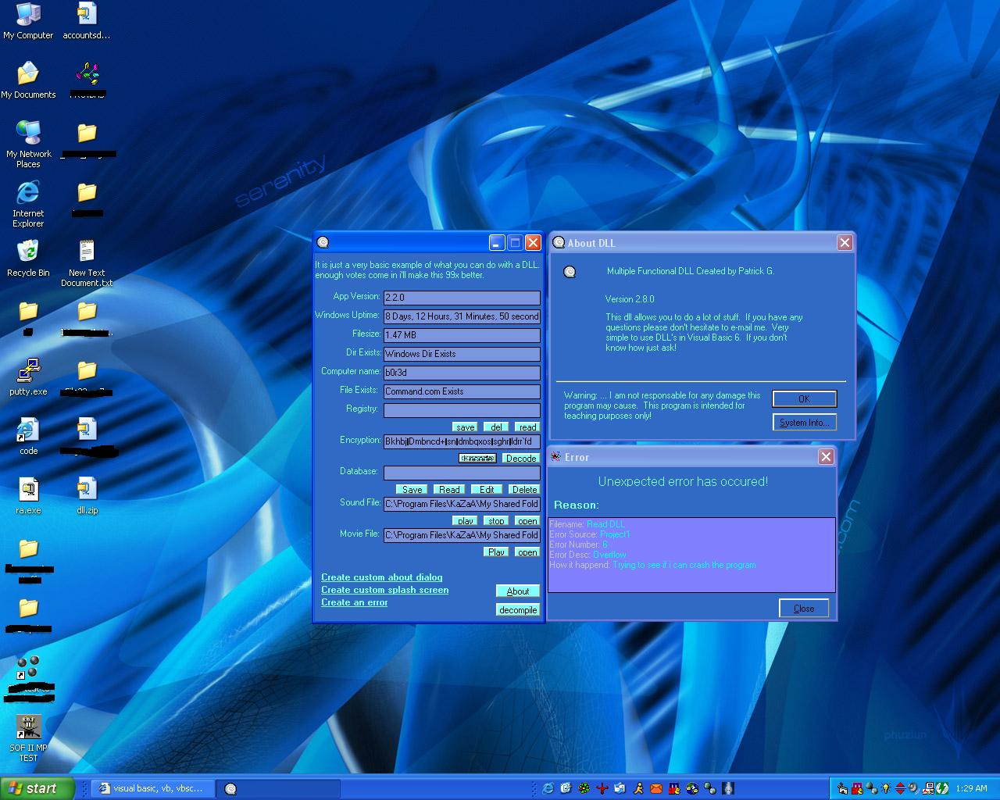



## Changing the ways of VB programming \(Make life so simple\)

### Description

Last update for this program for a long time. Basicly what i am trying to do is make visual basic programming so much easier for beginners or even advanced people. My way's may not be the best, but it gets the job done. Now, c'mon people, ** VOTE ** I really want to win *** ONE *** last time on PSC befor i stop programming for awhile. It's a really cool feeling!

Also PLEASE leave feedback. I love to hear what everyone has to say. If you don't think this program can help beginners or even advanced users let me know..

Enjoy!!!
 
### More Info
 

             |
---                |---
**Submitted On**   |2002-05-02 01:28:00
**By**             |[Patrick G](https://github.com/Planet-Source-Code/PSCIndex/blob/master/ByAuthor/patrick-g.md)
**Level**          |Advanced
**User Rating**    |4.5 (27 globes from 6 users)
**Compatibility**  |VB 5\.0, VB 6\.0
**Category**       |[Coding Standards](https://github.com/Planet-Source-Code/PSCIndex/blob/master/ByCategory/coding-standards__1-43.md)
**World**          |[Visual Basic](https://github.com/Planet-Source-Code/PSCIndex/blob/master/ByWorld/visual-basic.md)
**Archive File**   |[Changing\_t78390522002\.zip](https://github.com/Planet-Source-Code/patrick-g-changing-the-ways-of-vb-programming-make-life-so-simple__1-34332/archive/master.zip)

